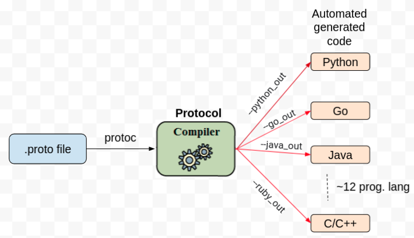
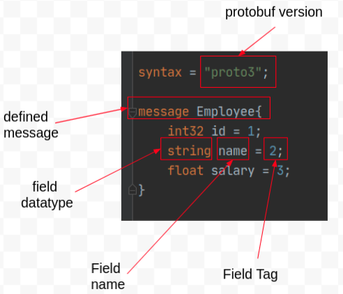

# A Detailed Introduction of Protocol Buffers


**Author**: [Pravin Ranjan](https://github.com/PravinRanjan10)

### <span style="color: maroon"> What is Protocol Buffers </span>

* The docs say: It is a language-neutral, platform-neutral, extensible mechanism for serializing structured data.

* It provides a common structure and specification which is useful for services(programs) that are communicating and sharing data over the network.

* Protocol Buffers is a free and open source cross-platform library developed by Google. It is also called protobuf in short.


### <span style="color: maroon"> Why Protocol Buffers is required </span>

To solve some of the existing problems of sharing the data over the network in an optimal way, protobuf was introduced. Before going into details, let's understand the history of storing and managing data.
##### A brief History: An Evolution of data
Over a period of time, data is stored in various formats. And still these are being used based on specific use cases.
* Excel
* CSV(Comma Separated Values):
* Relational Databases

The major drawback of above formats is they are not easy to share across networks. And that’s why they are rarely or almost not used in API development.

Below a few data formats are easy to share across networks and commonly used for API development

* HTML(Hypertext Markup Language)
* XML(eXtensible Markup Language)
* JSON(JavaScript Object Notation)
* Protocol Buffers

### <span style="color: maroon"> But why not XML or JSON? </span>

Protocol Buffers or XML or JSON are most commonly used messages specification; however, they were designed with different goals in mind. But,

+ As per several resources [1](https://github.com/protocolbuffers/protobuf/blob/master/docs/performance.md), [2](https://github.com/eishay/jvm-serializers/wiki), [3](https://maxondev.com/serialization-performance-comparison-c-net-formats-frameworks-xmldatacontractserializer-xmlserializer-binaryformatter-json-newtonsoft-servicestack-text/), protobuf performs better than JSON or XML

* The protocol buffers format is simplified and thus atleast 10 times smaller in size compare to JSON or XML

* Due to optimized Serialization mechanism it is much faster than JSON or XML.

* In addition to size and speed, Protobuf has a compiler capable of processing a .proto file to generate multiple supported languages, unlike the traditional method where it is necessary to arrange the same structure in multiple source files.  

* And :) : `
“ If it’s working for Google, there is a be great chance it will working for you”- Unknown Author
`

### <span style="color: maroon"> Detailed overview of Protocol Buffers </span>
#### How Protocol Buffers works
+ The Protocol Buffers, serialize(encode) all the objects from the .proto file before sharing over the network. And the same serialized object can be deserialized(decode) and transform into original objects based on receiving end programming languages.

+ Serialization means transforming the data into bytes type which is easy to share across the network.

  Example:
  ```go
    message Employee{
      string "name" = 1;
    }

    ====> to

    bytes stream: 14 12 07 5c 34 98 5d 89
  ```
  + Deserialize means transforming the bytes into objects  

  Example:
  ```go
    bytes stream: 14 12 07 5c 34 98 5d 89

    ====> to

    message Employee{
      string "name" = 1;
    }
  ```
* The protocol buffer compiler, `protoc`, is used to compile .proto files and generate xx.pb.xx(Ex: .pb.go), a language specific stub file. This stub file provides simple accessors for each field, like name() and set_name(), as well as methods to serialize/parse the whole structure to/from raw bytes.

  An example of generating stub file(.pb.go):

  ```go
  protoc -I <path_of_inputl_dir> --go_out= <path_of_out_dir>    <file>.proto
  ```

* Below diagram represents how protoc is used to generate stub code for different programming languages




### <span style="color: maroon"> Insight of .proto file </span>

* A .proto extension is an ordinary text file which contains two items:

  a). **message**: A structure for the data which is a small logical record of information containing a series of name-value pairs called fields. This is only exchanged among services over the network. Here’s a simple example:

  

  b). **service**: A collections of RPC methods which take input parameters as message and also return output as a type protobuf message

  Example:
  ```go
  // The greeter service definition.
  service Greeter {
    // Sends a greeting
    rpc SayHello (HelloRequest) returns (HelloReply) {}
  }

  // The request message containing the user's name.
  message HelloRequest {
    string name = 1;
  }

  // The response message containing the greetings
  message HelloReply {
    string message = 1;
  }
  ```

### More on protobuf message

* The first line of the `.proto` file specifies that you're using proto3 syntax: if you don't do this the protocol buffer compiler will assume you are using proto2. This must be the first non-empty, non-comment line of the file.

* **Field type**: Every field should be of some types either scalar type (double, int, string, bool, bytes etc.) or composite(enum etc.) type.

 + The list of message field types supported by protobuf is [here](https://developers.google.com/protocol-buffers/docs/proto3#scalar)

* **Tag**: One of the most important things in protobuf.
  + smallest tag: 1,

  + largest tag: 229 - 1, or 536,870,911

  + Reserved Tag: 19000 to 19999  (you can not use this!!)

  + tag number 1 to 15 take one bytes in size when messages are encoded. So it will be useful to use these tags for frequently used fields.
  * Tags number: 16 to 2047 uses 2 bytes

* **List/Array**: To create a list or array, `repeated` keyword is used.  
  + Example:

    ```go
    repeated string myList = 1;
    ```

* **Enumeration**:

 + The first value of enum must be default value

 + enum must start with tag 0, i.e default value
   ##### Example: employee.proto
   ```go
    syntax = "proto3";

    message Employee {

      int32 id = 1;
      string name = 2;
      float salary = 3;

      // declaration of enum
      enum DeptFloor {
        DEFAULT_DEPT_FLOOR = 0;
        STORAGE_FLOOR = 1;
        CLOUD_FLOOR = 2;
      }

      // defining enum as type
      DeptFloor my_floor = 4;
    }
    ```

### Defining multiple messages
In the below example, there is a `message Employee`. An another `message JoinDate` is created which is used as a data type in `message Employee`  
  + Example: employee.proto

    ```go
    syntax = "proto3";

    message Employee{
      int32 id = 1;
      string name = 2;
      float salary = 3;
      // JoinDate is another message
      // which will act as type here
      JoinDate empjoindate = 4;
    }

    message JoinDate{
      // this is just sample comment
      int32 year = 1;
      int32 month = 2;
      int32 day = 3;
    }
    ```

### Defining nested messages
Another `message Address` is added inside `message Employee`. The tag number of the inner message should start from 1.  
  + Example: employee.proto

    ```go
    syntax = "proto3";

    message Employee{
      int32 id = 1;
      string name = 2;
      float salary = 3;

      // A example of nested message
      message Address{
          string country = 1;
          string district = 2;
          string city = 3;
          int32 streetNumber = 4;
      }

      int32 phoneNumber = 4;
    }
    ```

### Import message from another files
  + Example: employee.proto
    ```go
    syntax = "proto3";

    // Import the actual file.
    import "path_of_file/file.proto";

    message Employee{
      ----
      ----
    }
    ```

### Defining a Packages
  + packages are optional specifiers to a .proto file to prevent name clashes between protocol message types.

    Example: joindate.proto
    ```go
    syntax = "proto3";

    package my.joindate;

    message JoinDate{
        // this is just sample comment
        int32 year = 1;
        int32 month = 2;
        int32 day = 3;
    }
    ```
    + Example: employee.proto

    ```go
    syntax = "proto3";

    import "joindate.proto";

    message Employee{
        int32 id = 1;
        string name = 2;
        float salary = 3;
        // example of using message using import and package name
        my.joindate.JoinDate empjoindate = 4;
    }

    ```

### Option go_package
option is used to change the behaviour of the compiler. Actually it rename the actual package name to go_package name to follow more go programming style. For example, the original package was `my.joindate` but now it is aliased as `joindatepb`. And now the `joindatepb` can be used in programs during import.

  + Example: employee.proto

    ```go
    syntax = "proto3";

    package my.joindate;

    // use option to modify and make alias name for originally  defined package
    option go_package = "joindatepb";

    message JoinDate{
        // this is just sample comment
        int32 year = 1;
        int32 month = 2;
        int32 day = 3;
    }

    ```

## Updating the protocol buffers
Sometimes fields need to be updated because of design or requirement changes. In this case, some fields may change, some fields may be added and others removed. So to accomodate any version changes, protobuf supports backward compatibility and forward compatibility.
Below is the best practises can be used during updation

  + Don't change the existing field tag number
  + A new fields can be added with new tag number

    Example: employee.proto
    ```go
      message Employee{
          string first_name = 1;
          // A new field can be added as last_name
          string last_name = 2;
      }
    ```

  + A field can be removed, but make sure the tag number of that field is not used by any other field. The better approach to remove the field is to just rename the field by adding prefix "OBSOLETE_" or make the tag reserved to avoid any accidental use.

    Example: employee.proto
    ```go
      message Employee{
          string first_name = 1;
          string last_name = 2;
          int32 age = 3;
      }
    ```
      ##### Removing filed: **Approach1**:

      Here just remove the field(s), let's say `last_name`. If old code doesn't find the field anymore, the default value will be used. But the problem with this approach is if somebody uses the field name `last_name` and tag number `2` (w.r.t this example) in future, there will be a conflict. And it may break codes.
    ```go
      message Employee{
          string first_name = 1;
          int32 age = 3;
      }
    ```
    ##### Removing filed: **Approach2**:
    To prevent name and tag to be re-used, add them as reserved or obsolete. For example:
    ```go
      message Employee{
          // reserve the name and tag number
          reserved 2;
          reserved "last_name";
          string first_name = 1;
          int32 age = 3;

          // OR add as obsolete
          OBSOLETE_last_name = 1;
      }
    ```
    Some more example of reserving name and tag numbers
    ```go
      message Employee{
          // reserve the name and tag number
          reserved 2, 3, 8, 20 to 30;
          reserved "last_name", "first_name", "address";
      }
    ```


  + A field can be renamed without any issue but make sure tag number is remain same

## Unknown fields
**Any**:
* when you have to pick any element from list or map, **Any** can be used.
* To use the **Any** type, you need to import google/protobuf/any.proto

  Example: employee.proto
  ```go
  syntax = "proto3";
  import "google/protobuf/any.proto";

  message Employee {
    string message = 1;
    repeated google.protobuf.Any details = 2;
  }
  ```

**Oneof**:
  * when there is need of one item from a fields of message, **Oneof** can be used
  Example: employee.proto
  ```go
  syntax = "proto3";

  message Employee {
    string "first_name" = 1;
    oneof example_oneof{
      string "second_name" = 2;
      string "last_name" = 3;
    }
  }
  ```

**Timestamp**:
  + Timestamp can be used by importing timestamp.proto. It's values are in seconds and nanoseconds.

  Example: employee.proto
  ```go
  syntax = "proto3";
  import "google/protobuf/timestamp.proto";

  message Employee {
    string message = 1;
    google.protobuf.Timestamp my_time = 2;
  }
  ```

#### References
1. https://developers.google.com/protocol-buffers
